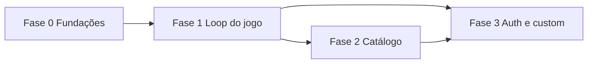

# Roadmap — MusicApp

> Fases ordenadas por valor + dependência. Cada fase é um candidato a épico.

## Fase 0 — Fundações

- **Objetivo:** ambiente reproduzível e esqueleto da API, para as fases seguintes não começarem por infra.
- **Entregáveis:** solução .NET 10 em camadas; PostgreSQL no Compose; imagens de API e frontend; pasta `.docs/` viva.
- **Critérios de saída:** `docker compose up --build` sobe os três serviços; `GET /health/live` responde 200; testes de integração da raiz/live passam.
- **Esforço (tamanho):** M
- **Dependências:** nenhuma
- **Situação:** código da fundação entregue (2026-08-15). Compose por validar com Docker Desktop.

## Fase 1 — Loop do jogo

- **Objetivo:** uma partida jogável (ouvir trecho, palpite, mais áudio se errar).
- **Capacidades incluídas:** RF1, RF2, RF3
- **Entregáveis:** UI do jogo no Next.js; endpoints de puzzle/palpite; primeira migration; decisão da fonte de áudio.
- **Critérios de saída:** um jogador sem conta completa uma partida no navegador contra a API.
- **Riscos:** direitos de autor; contrato de palpite (typeahead vs texto livre) por fechar.
- **Esforço (tamanho):** L
- **Dependências:** Fase 0; ADR da fonte de áudio

## Fase 2 — Catálogo e gêneros

- **Objetivo:** mais do que um puzzle único — escolher gênero / conjunto de músicas.
- **Capacidades incluídas:** catálogo, gêneros (All / Rock / Hip Hop no original, adaptável).
- **Entregáveis:** CRUD ou seed de músicas; filtro de gênero na UI.
- **Critérios de saída:** o jogador inicia uma partida num gênero e recebe um trecho coerente.
- **Riscos:** qualidade/licença do catálogo.
- **Esforço (tamanho):** M
- **Dependências:** Fase 1

## Fase 3 — Conta, stats e jogos custom

- **Objetivo:** o jogador autentica-se, guarda histórico e cria jogos.
- **Capacidades incluídas:** RF4, RF5
- **Entregáveis:** auth; persistência de partidas por usuário; criação de puzzle custom.
- **Critérios de saída:** login; stats visíveis após várias partidas; um jogo custom jogável.
- **Riscos:** segurança (OWASP); retenção de dados (LGPD).
- **Esforço (tamanho):** L
- **Dependências:** Fase 1 (Fase 2 desejável mas não bloqueante)

## Mapa de dependências

## Sugestão de decomposição

Quebrar a Fase 1 em user stories (critérios Gherkin) e só então implementar o domínio do jogo. Não avançar entidades de música enquanto a fonte de áudio estiver em aberto.
