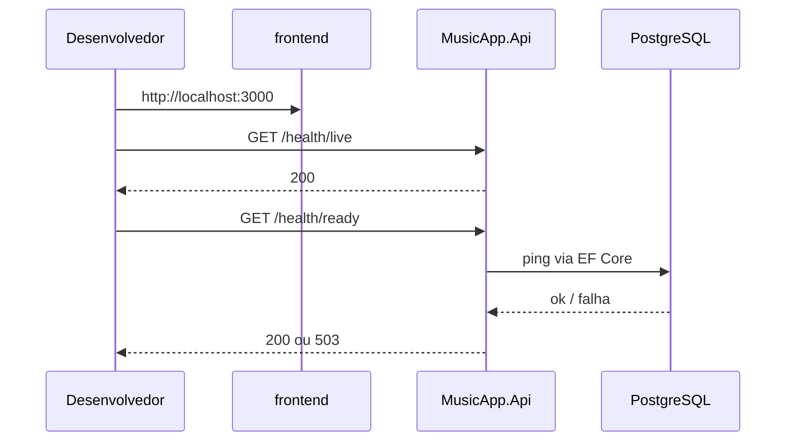

# Fundações — backend .NET 10, Docker e documentação

> **Situação**: Concluída
> **Ramo**: o da árvore de trabalho atual
> **Autor(es)**: Equipe MusicApp
> **Data**: 2026-08-15
> **Sprint/Release**: Fase 0

---

## 1. Visão funcional

### 1.1 Objetivo de negócio
Deixar o monorepo com um backend que sobe, uma base de dados local e um Compose com frontend + API + PostgreSQL, mais uma pasta `.docs/` que guarda o histórico do que for sendo feito.

### 1.2 Critérios de aceite
- [x] Solução .NET 10 em `backend/` com camadas Domain / Application / Infrastructure / Api
- [x] PostgreSQL configurado via Docker Compose
- [x] Frontend e backend também no Compose
- [x] Sem autenticação (adiada)
- [x] Documentação em `.docs/` (Arquitetura + Documentacao + CHANGELOG + ADRs)

### 1.3 Fluxo do usuário
Quem desenvolve copia `.env.example` para `.env`, corre `docker compose up --build`, abre o frontend em http://localhost:3000 e a API em http://localhost:8080. Não há fluxo de jogador nesta entrega.

### 1.4 Regras de negócio aplicadas
Nenhuma regra de jogo. A API só expõe raiz (`nome`/`versao`) e health checks.

---

## 2. Visão técnica

### 2.1 Arquitetura impactada



### 2.2 Frontend
- `frontend/Dockerfile` — imagem standalone (Next.js `output: "standalone"`).
- `frontend/next.config.ts` — `output: "standalone"` (só afeta `next build`, não o `pnpm dev`).
- Sem rotas, serviços nem UI do jogo nesta entrega. A página continua o template do create-next-app.

### 2.3 Backend
- `GET /` → `{ nome, versao }` (200)
- `GET /health/live` → 200 sem tocar na BD
- `GET /health/ready` → 200/503 conforme o `AppDbContext` alcança o PostgreSQL
- OpenAPI em Development (`/openapi/v1.json`)
- CORS para `http://localhost:3000`
- Sem use cases de domínio; `AddApplication()` está vazio de propósito

### 2.4 Banco de dados
- PostgreSQL 16 (imagem `postgres:16-alpine`)
- Usuário/BD locais: `musicapp` (ver `.env.example`)
- `AppDbContext` sem `DbSet` — **nenhuma migration nesta entrega**
- Tabela `public.__EFMigrationsHistory` só aparecerá na primeira `dotnet ef migrations add`

### 2.5 Configuração e variáveis de ambiente

| Variável | Propósito | Obrigatória? |
|---|---|---|
| `POSTGRES_USER` | Usuário do contêiner PostgreSQL | Não (default `musicapp`) |
| `POSTGRES_PASSWORD` | Senha local | Não (default `musicapp`) |
| `POSTGRES_DB` | Nome da base | Não (default `musicapp`) |
| `POSTGRES_PORT` | Porta no host | Não (5432) |
| `API_PORT` | Porta da API no host | Não (8080) |
| `FRONTEND_PORT` | Porta do Next no host | Não (3000) |
| `ConnectionStrings__BancoDeDados` | Connection string da API (Compose) | Sim, no contêiner |

Valores em `appsettings.json` / `.env.example` são **só para desenvolvimento local**.

### 2.6 Decisões de design e custos de cada escolha
- Clean Architecture completa mesmo sem domínio: paga um pouco de cerimônia agora para a Fase 1 não ter de partir a solução.
- Health live vs ready: o Compose e os testes não exigem PostgreSQL para saber se o processo da API está de pé.
- Sem Testcontainers nesta fundação: o teste cobre live/raiz; ready fica para quando houver BD de teste.

---

## 3. Como testar

### 3.1 Pré-requisitos
- SDK .NET 10 (`10.0.400` ou superior com roll-forward)
- Docker Desktop para o Compose (não estava no PATH desta máquina no momento da entrega)
- Node 22 + pnpm 11 para o frontend fora do Docker

### 3.2 Testes automatizados
- Integração: `backend/tests/MusicApp.IntegrationTests/SaudeEndpointTestes.cs`
  - `DeveResponderOkNoHealthLive`
  - `DeveResponderOkNaRaizComNomeDaApi`
- Ferramenta local `dotnet-ef` 10.0.11 em `backend/.config/dotnet-tools.json` (`dotnet tool restore` na pasta `backend/`)

```bash
dotnet test backend/MusicApp.slnx
```

### 3.3 Testes manuais (fumaça)
1. `Copy-Item .env.example .env`
2. `docker compose up --build`
3. Abrir http://localhost:8080/health/live → 200
4. Abrir http://localhost:8080/health/ready → 200 quando o Postgres estiver healthy
5. Abrir http://localhost:3000 → template Next.js

---

## 4. Riscos, limitações e próximos passos

- **Riscos conhecidos:** Compose não validado nesta máquina (Docker indisponível no PATH).
- **Limitações atuais:** sem entidades, sem migration, sem auth, frontend ainda template.
- **Dívida técnica registrada:** teste de `/health/ready` com Testcontainers; senha local em appsettings.
- **Próximos passos sugeridos:** Fase 1 (loop do jogo) depois de ADR da fonte de áudio.

---

## 5. Referências

- Ticket/US: Fase 0 — fundações (pedido em chat)
- PR(s): ainda não aberto
- Design/Figma: [Songless](https://less.gg/songless)
- Documentos relacionados: [manual](../Arquitetura/manual-do-projeto.md), [roadmap](../Arquitetura/roadmap.md), [ADR-0001](ADRs/0001-monolito-modular-clean-architecture.md), [ADR-0002](ADRs/0002-postgresql-como-bd-primaria.md), [ADR-0003](ADRs/0003-docker-compose-ambiente-local.md)
